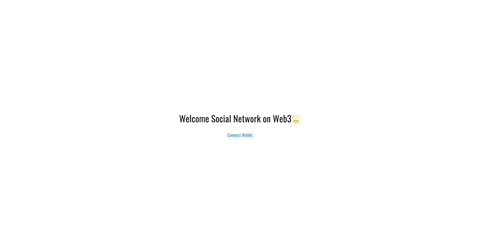
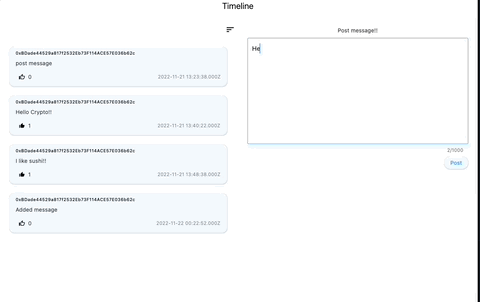
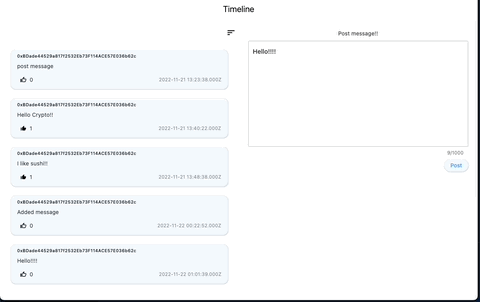
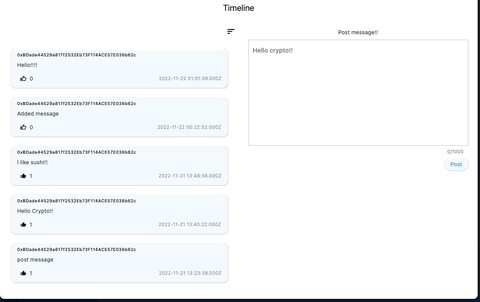

# STAR試験

STAR試験のSocial network 3.0
フロントエンドのプロジェクトです

## 概要

本プロジェクトでは以下の機能を体験できます

- ユーザーが自分のウォレットをWEBアプリケーションに接続できる。

- ユーザーがWEBアプリケーションのグローバルタイムラインに投稿をアップロードできる
    - 投稿は、投稿日時がUTCで表示される
    - 投稿には、いいね！の数が表示される
    - 投稿者のウォレットアドレスが表示される

- ユーザーはどの投稿にも「いいね！」をつけることができる
    - 1ユーザーにつき1投稿に1「いいね！」まで
    - 「いいね！」をもう一度することで「いいね！」を取り消すことができる

- グローバルタイムラインは、すべてのユーザーの投稿を見ることができる
    - ユーザーは、アップロード時間と「いいね！」の数に基づいて、タイムラインをソートす

